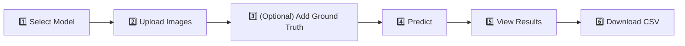

# 🚀 Quick Start Guide - OrdCMViT Streamlit App

## 5-Minute Setup

### Prerequisites
✅ Python 3.8+  
✅ Trained OrdCMViT model checkpoint  
✅ Patient images (ultrasound + mammogram)  

### Installation (2 minutes)

```bash
# Navigate to project directory
cd ./OrdCMViT

# Install dependencies
pip install -r requirements.txt

# Verify Streamlit is installed
streamlit --version
```

### Launch (30 seconds)

```bash
# Run the app
streamlit run streamlit_app.py
```

✅ **Browser opens automatically at:** `http://localhost:8501`

---

## Using the App (3 minutes)

### Workflow



### Step-by-Step

#### 1. **Select Model**
   - Sidebar: Choose from dropdown "Select Model Run"
   - Click "Load Model" button
   - Wait for ✅ confirmation

#### 2. **Upload Patient Images**

   **Option A - Individual Images (Easiest):**
   - Upload Ultrasound image
   - Upload Mammogram image
   
   **Option B - ZIP Folder:**
   - Create ZIP with structure:
     ```
     patient.zip/
     ├── Ultrasound/image.png
     └── Mammogram/image.jpg
     ```
   - Upload ZIP file

#### 3. **(Optional) Add Ground Truth**
   - Check "I have ground truth BI-RADS"
   - Select actual BI-RADS (1-5)
   - App shows accuracy

#### 4. **Predict**
   - Click **"🔮 Predict BI-RADS"** button
   - Wait ~2-5 seconds

#### 5. **View Results**
   - 📊 **Predicted BI-RADS**: Classification (1-5)
   - 📈 **Confidence Score**: Probability (0-100%)
   - 📋 **Class Probabilities**: Bar chart of all classes
   - ✅ **Correctness**: If ground truth provided

#### 6. **Save Results**
   - Click **"💾 Save Results to CSV"**
   - Download patient prediction record

---

## Example Output

### Prediction Results Display:

```
┌─────────────────────────────────────────┐
│ Predicted BI-RADS │ Confidence │ Status │
│        4          │   87.3%    │   ✅   │
│   Suspicious      │            │Correct │
│  (Biopsy Rec.)    │            │        │
└─────────────────────────────────────────┘

Class Probabilities:
BI-RADS 1: ▁ 2.1%
BI-RADS 2: ▃ 5.8%
BI-RADS 3: ▅ 8.6%
BI-RADS 4: ██████████ 87.3%  ← Predicted
BI-RADS 5: ▂ 3.2%
```

---

## Common Tasks

### Process Single Patient
1. Upload images (individual or ZIP)
2. Add ground truth (if available)
3. Click "Predict"
4. Download results

### Batch Process Multiple Patients
```python
# Create batch_predict.py
from pathlib import Path
import pandas as pd
from streamlit_app import load_model, predict_patient

# Load model
model = load_model("./ordcmvit_runs/4/ordcmvit/checkpoints/best.pth", device)

# Process folder
results = []
for patient in Path("./patients").glob("P*"):
    us = load_image(patient / "Ultrasound/image.png")
    mm = load_image(patient / "Mammogram/image.jpg")
    pred = predict_patient(us, mm, model, device, cfg)
    results.append({"id": patient.name, "birads": pred["pred_birads"]})

df = pd.DataFrame(results)
df.to_csv("results.csv")
```

---

## Image Requirements

| Modality | Size | Format | Notes |
|----------|------|--------|-------|
| Ultrasound | ~384×384 | PNG, JPG, TIFF | Will be resized automatically |
| Mammogram | ~384×384 | PNG, JPG, TIFF, DICOM | Will be resized automatically |

---

## BI-RADS Quick Reference

| Level | Name | Action | Color |
|-------|------|--------|-------|
| **1** | Normal | Routine screening | 🟢 |
| **2** | Benign | No intervention | 🔵 |
| **3** | Probably Benign | 6-month follow-up | 🟠 |
| **4** | Suspicious | Biopsy recommended | 🟠 |
| **5** | Malignant | Likely malignancy | 🔴 |

---

## Troubleshooting

| Issue | Solution |
|-------|----------|
| "No models found" | Run `python main.py` to train first |
| "Model fails to load" | Check checkpoint path exists |
| "Images won't upload" | Use PNG/JPG/JPEG formats |
| "Prediction is slow" | First run slower; subsequent runs cached |

---

## Tips & Tricks

✅ **Better Results:**
- Use high-quality, clear images
- Ensure images focus on lesion/area of interest
- Provide ground truth for validation
- Keep same resolution across patients

📊 **Batch Processing:**
- Use ZIP folders for organized uploads
- Save results CSV for batch analysis
- Run multiple predictions without restarting

🔧 **Model Comparison:**
- Load different checkpoints from sidebar
- Compare predictions across model versions
- Track which model performs best

---

## Next Steps

1. ✅ Train model: `python main.py --data_root ./BCMID --labels_csv ./BCMID/BCMID_labels.csv`
2. ✅ Launch app: `streamlit run streamlit_app.py`
3. ✅ Upload images and get predictions!

---

## Need Help?

📖 Full documentation: See `STREAMLIT_README.md`  
🔧 Report issues: [GitHub Issues]  
💬 Questions: Check Q&A section  

Enjoy using OrdCMViT! 🏥
